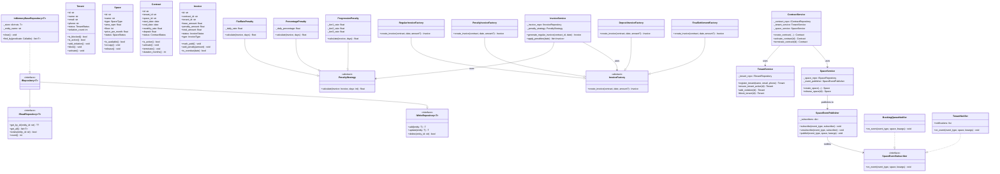

# Class Diagram — Rental Management System

```mermaid
classDiagram
    direction TB

    %% ─── Interfaces ───────────────────────────────
    class IReadRepository~T~ {
        <<interface>>
        +get_by_id(entity_id: str) T?
        +get_all() list~T~
        +exists(entity_id: str) bool
        +count() int
    }

    class IWriteRepository~T~ {
        <<interface>>
        +add(entity: T) T
        +update(entity: T) T
        +delete(entity_id: str) bool
    }

    class IRepository~T~ {
        <<interface>>
    }
    IRepository --|> IReadRepository
    IRepository --|> IWriteRepository

    %% ─── Base Repository ──────────────────────────
    class InMemoryBaseRepository~T~ {
        -_store: dict~str, T~
        -_entity_name: str
        +clear() void
        +find_by(predicate: Callable) list~T~
    }
    InMemoryBaseRepository ..|> IRepository

    %% ─── Models ───────────────────────────────────
    class Tenant {
        +id: str
        +name: str
        +email: str
        +phone: str
        +status: TenantStatus
        +violation_count: int
        +is_blocked() bool
        +is_active() bool
        +add_violation() void
        +block() void
        +activate() void
    }

    class Space {
        +id: str
        +name: str
        +type: SpaceType
        +area_sqm: float
        +floor: int
        +price_per_month: float
        +status: SpaceStatus
        +is_available() bool
        +occupy() void
        +release() void
    }

    class Contract {
        +id: str
        +tenant_id: str
        +space_id: str
        +start_date: date
        +end_date: date
        +monthly_rate: float
        +deposit: float
        +status: ContractStatus
        +is_active() bool
        +activate() void
        +terminate() void
        +duration_months() int
    }

    class Invoice {
        +id: str
        +contract_id: str
        +tenant_id: str
        +base_amount: float
        +penalty_amount: float
        +total_amount: float
        +status: InvoiceStatus
        +type: InvoiceType
        +mark_paid() void
        +add_penalty(amount) void
        +is_overdue(date) bool
    }

    %% ─── Strategy Pattern ─────────────────────────
    class PenaltyStrategy {
        <<abstract>>
        +calculate(invoice: Invoice, days: int) float
    }
    class FlatRatePenalty {
        -_daily_rate: float
        +calculate(invoice, days) float
    }
    class PercentagePenalty {
        -_daily_percentage: float
        +calculate(invoice, days) float
    }
    class ProgressivePenalty {
        -_tier1_rate: float
        -_tier2_rate: float
        -_tier3_rate: float
        +calculate(invoice, days) float
    }
    FlatRatePenalty --|> PenaltyStrategy
    PercentagePenalty --|> PenaltyStrategy
    ProgressivePenalty --|> PenaltyStrategy

    %% ─── Factory Method Pattern ───────────────────
    class InvoiceFactory {
        <<abstract>>
        +create_invoice(contract, date, amount?) Invoice
    }
    class RegularInvoiceFactory {
        +create_invoice(contract, date, amount?) Invoice
    }
    class PenaltyInvoiceFactory {
        +create_invoice(contract, date, amount?) Invoice
    }
    class DepositInvoiceFactory {
        +create_invoice(contract, date, amount?) Invoice
    }
    class FinalSettlementFactory {
        +create_invoice(contract, date, amount?) Invoice
    }
    RegularInvoiceFactory --|> InvoiceFactory
    PenaltyInvoiceFactory --|> InvoiceFactory
    DepositInvoiceFactory --|> InvoiceFactory
    FinalSettlementFactory --|> InvoiceFactory

    %% ─── Observer Pattern ─────────────────────────
    class SpaceEventSubscriber {
        <<interface>>
        +on_event(event_type, space, kwargs) void
    }
    class SpaceEventPublisher {
        -_subscribers: dict
        +subscribe(event_type, subscriber) void
        +unsubscribe(event_type, subscriber) void
        +publish(event_type, space, kwargs) void
    }
    class BookingQueueNotifier {
        +on_event(event_type, space, kwargs) void
    }
    class TenantNotifier {
        +notifications: list
        +on_event(event_type, space, kwargs) void
    }
    BookingQueueNotifier ..|> SpaceEventSubscriber
    TenantNotifier ..|> SpaceEventSubscriber
    SpaceEventPublisher --> SpaceEventSubscriber : notifies

    %% ─── Services ─────────────────────────────────
    class TenantService {
        -_tenant_repo: ITenantRepository
        +register_tenant(name, email, phone) Tenant
        +ensure_tenant_active(id) Tenant
        +add_violation(id) Tenant
        +block_tenant(id) Tenant
    }

    class SpaceService {
        -_space_repo: ISpaceRepository
        -_event_publisher: SpaceEventPublisher
        +create_space(...) Space
        +release_space(id) Space
    }

    class ContractService {
        -_contract_repo: IContractRepository
        -_tenant_service: TenantService
        -_space_service: SpaceService
        +create_contract(...) Contract
        +activate_contract(id) Contract
        +terminate_contract(id) Contract
    }

    class InvoiceService {
        -_invoice_repo: IInvoiceRepository
        -_penalty_strategy: PenaltyStrategy
        +generate_regular_invoice(contract_id, date) Invoice
        +apply_penalties(date) list~Invoice~
    }

    %% ─── Service Dependencies ─────────────────────
    ContractService --> TenantService : uses
    ContractService --> SpaceService : uses
    InvoiceService --> PenaltyStrategy : uses
    InvoiceService --> InvoiceFactory : uses
    SpaceService --> SpaceEventPublisher : publishes to
```
