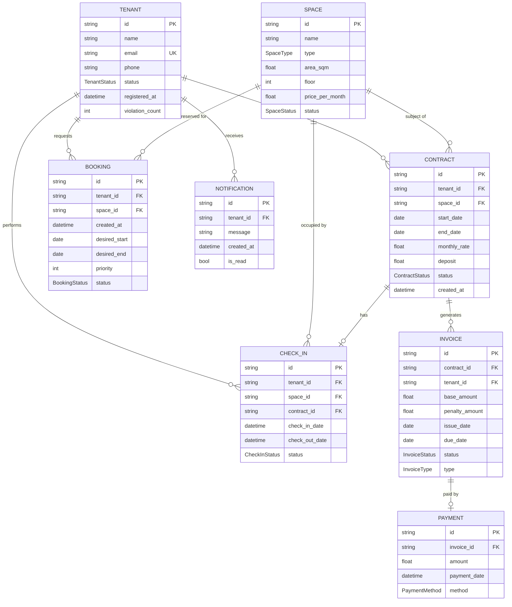

# Domain Model — Rental Management System

## Entity Relationships

| Relationship | Cardinality | Description |
|-------------|-------------|-------------|
| Tenant → Contract | 1:N | A tenant can have multiple contracts |
| Tenant → Booking | 1:N | A tenant can have multiple bookings |
| Tenant → CheckIn | 1:N | A tenant can have multiple check-in records |
| Space → Contract | 1:N | A space can have multiple contracts (sequential) |
| Space → Booking | 1:N | A space can have multiple bookings (waitlist) |
| Contract → Invoice | 1:N | A contract generates multiple invoices |
| Contract → CheckIn | 1:0..1 | A contract has at most one active check-in |
| Invoice → Payment | 1:0..1 | An invoice can have one payment |
| Tenant → Notification | 1:N | A tenant receives multiple notifications |
