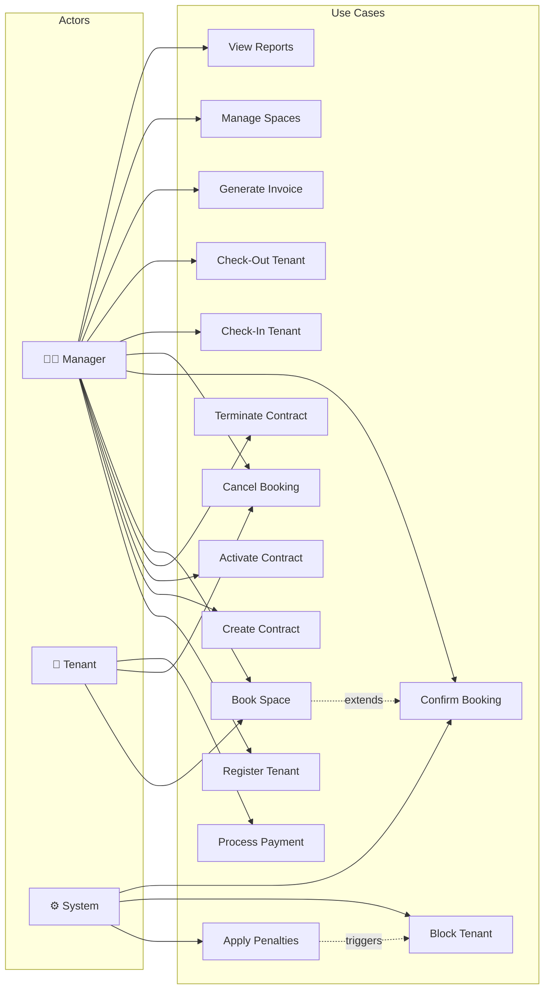

# Use Case Diagram — Rental Management System

## Use Case Descriptions

| # | Use Case | Actor | Precondition | Success Scenario |
|---|----------|-------|-------------|------------------|
| 1 | **Register Tenant** | Manager | — | Tenant created with ACTIVE status |
| 2 | **Create Contract** | Manager | Tenant is ACTIVE, Space exists | Draft contract created |
| 3 | **Activate Contract** | Manager | Contract in DRAFT | Contract activated, space OCCUPIED |
| 4 | **Terminate Contract** | Manager | Contract is ACTIVE | Contract terminated, space AVAILABLE |
| 5 | **Book Space** | Manager/Tenant | Tenant is ACTIVE | Pending booking added to queue |
| 6 | **Confirm Booking** | Manager/System | Booking is PENDING | Booking confirmed |
| 7 | **Cancel Booking** | Manager/Tenant | Booking not CANCELLED | Booking cancelled |
| 8 | **Check-In Tenant** | Manager | Active contract, tenant ACTIVE | Check-in recorded |
| 9 | **Check-Out Tenant** | Manager | Active check-in exists | Check-out recorded with timestamp |
| 10 | **Generate Invoice** | Manager | Active contract | Invoice created (regular/penalty/deposit/settlement) |
| 11 | **Process Payment** | Tenant | Pending/overdue invoice | Payment recorded, invoice marked PAID |
| 12 | **Apply Penalties** | System | Overdue invoices exist | Penalties calculated via Strategy, violations added |
| 13 | **Block Tenant** | System | 3+ violations | Tenant status set to BLOCKED |
| 14 | **Manage Spaces** | Manager | — | Create/update/delete spaces |
| 15 | **View Reports** | Manager | — | View invoices, payments, occupancy |
